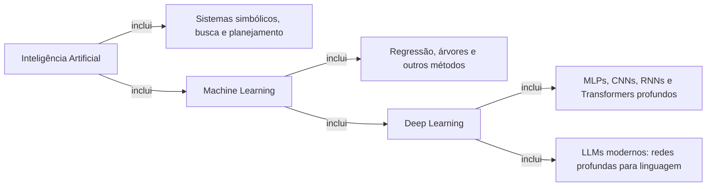
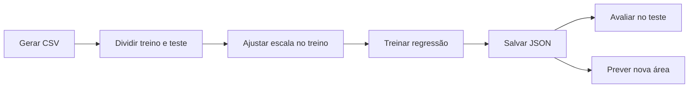

# Fundamentos de Machine Learning: do dado ao gradiente

> **SOS Capacita — Programação com IA**
> **Módulo — Introdução ao Machine Learning e fundamentos matemáticos**

> Um modelo não “aprende” por magia: ele representa entradas numericamente, calcula uma saída,
> mede um erro e ajusta parâmetros segundo um objetivo.

Este README é a apresentação principal do módulo. Ele organiza os conceitos na ordem da aula,
aponta para práticas executáveis e conecta todo o material complementar do repositório.

---

## Sumário

1. [O que vamos construir](#1-o-que-vamos-construir)
2. [IA, Machine Learning e Deep Learning](#2-ia-machine-learning-e-deep-learning)
3. [O que significa aprender com dados](#3-o-que-significa-aprender-com-dados)
4. [Como números representam um problema](#4-como-números-representam-um-problema)
5. [Modelo, parâmetros e previsões](#5-modelo-parâmetros-e-previsões)
6. [Erro, perda e avaliação](#6-erro-perda-e-avaliação)
7. [Gradiente e treinamento](#7-gradiente-e-treinamento)
8. [Projeto progressivo: preço de imóveis](#8-projeto-progressivo-preço-de-imóveis)
9. [Por que agora existe um `pyproject.toml`](#9-por-que-agora-existe-um-pyprojecttoml)
10. [Preparação do ambiente](#10-preparação-do-ambiente)
11. [Mapa completo do conteúdo](#11-mapa-completo-do-conteúdo)
12. [Qualidade, limites e próximos passos](#12-qualidade-limites-e-próximos-passos)

---

## 1. O que vamos construir

Nos módulos anteriores, programas executavam regras escritas diretamente por nós. Agora vamos
implementar um sistema no qual parte do comportamento é determinada por parâmetros ajustados a
partir de exemplos.

A sequência central será:

```text
problema → dados → representação numérica → modelo → previsão
         → erro → gradiente → atualização dos parâmetros → nova previsão
```

Ao final da trilha inicial, você deverá conseguir:

- distinguir IA, ML, Deep Learning e modelos generativos;
- transformar um problema em atributos, alvo e métrica;
- separar treino e teste sem vazamento de informação;
- interpretar escalares, vetores, matrizes e suas formas;
- implementar regressão linear e gradiente descendente sem framework;
- comparar a implementação manual com NumPy e Scikit-learn;
- treinar, avaliar, salvar e carregar um modelo pela linha de comando;
- explicar por que uma boa métrica não garante causalidade, justiça ou utilidade real.

O objetivo não é decorar uma chamada como `model.fit(X, y)`. É compreender quais decisões essa
chamada não toma por nós.

---

## 2. IA, Machine Learning e Deep Learning

**Inteligência Artificial (IA)** é o campo mais amplo: estuda e constrói sistemas capazes de
realizar tarefas associadas a capacidades inteligentes. Ele inclui abordagens que aprendem com
dados e abordagens cujas regras e representações são programadas de maneira explícita, como certos
sistemas simbólicos, de busca e de planejamento.

**Machine Learning (ML), ou Aprendizado de Máquina, é um subcampo da IA.** Em ML, um algoritmo
ajusta o comportamento de um modelo a partir de dados e de um objetivo. Regressão linear,
regressão logística, árvores de decisão e redes neurais são exemplos de famílias estudadas em ML.

**Deep Learning (DL), ou Aprendizado Profundo, é uma abordagem dentro de ML** e, mais
especificamente, do aprendizado de representações. Ele usa redes neurais com sucessivas camadas de
representação: camadas posteriores combinam representações produzidas pelas anteriores. Portanto,
todo sistema de DL é um sistema de ML na taxonomia usada aqui, mas nem todo ML usa DL.

**Um LLM moderno é um modelo de linguagem construído com Deep Learning.** Ele é uma rede neural
profunda — tipicamente baseada na arquitetura Transformer — treinada para modelar regularidades em
grandes coleções de texto e prever tokens segundo um contexto. “Large” indica grande escala de
parâmetros e dados, mas não possui um limiar científico universal. LLM não é um campo paralelo a
IA, ML e DL: é uma família de modelos dentro do ramo de Deep Learning aplicado à linguagem.



As setas significam “inclui”, não “é igual a”. A relação principal pode ser resumida como
`Deep Learning ⊂ Machine Learning ⊂ Inteligência Artificial`. O LLM aparece como uma família de
modelos, não como mais um campo no mesmo nível.

Essa organização segue a taxonomia apresentada por Goodfellow, Bengio e Courville, cuja Figura
1.4 coloca DL dentro de aprendizado de representações, dentro de ML, e ML dentro das abordagens de
IA. Murphy trata Transformers, GPT e outros modelos de linguagem no estudo de redes neurais. Veja
o [capítulo introdutório de *Deep Learning*](https://www.deeplearningbook.org/contents/intro.html),
o [sumário de *Probabilistic Machine Learning*](https://probml.github.io/pml-book/toc1.pdf) e as
[referências gerais do curso](docs/referencias-gerais.md).

### O que torna uma rede “profunda”?

Uma rede neural combina unidades em **camadas**. Em uma forma simplificada, uma unidade recebe um
vetor `x`, calcula uma soma ponderada `z = w·x + b` e aplica uma função de ativação `a = g(z)`.
Compor camadas permite que a rede transforme a representação gradualmente:

```text
entrada → camada 1 → camada 2 → ... → camada de saída
```

A **profundidade** está associada ao número de transformações sucessivas entre entrada e saída,
não ao tamanho do dataset nem à quantidade de linhas de código. Não existe um número único de
camadas que separe universalmente uma rede “rasa” de uma “profunda”; o termo enfatiza a composição
de múltiplos níveis de representação. Mais profundidade também não garante automaticamente um
modelo melhor: aumenta capacidade, custo e dificuldade de otimização.

### MLP: a composição mais direta de camadas

**MLP** significa *multilayer perceptron* ou perceptron multicamada. Também é chamada de rede
*feedforward*: durante uma previsão, a informação segue da entrada para a saída sem uma conexão
recorrente que devolva o estado à própria rede.

Em uma camada densa de uma MLP, cada unidade recebe normalmente todas as saídas da camada anterior.
A rede aprende matrizes de pesos e vetores de vieses. Ativações não lineares entre as camadas são
essenciais: empilhar apenas transformações lineares continuaria equivalente a uma única
transformação linear.

MLPs podem aproximar relações não lineares e trabalhar com vetores de atributos, mas ignoram por
padrão estruturas específicas como vizinhança entre pixels ou ordem temporal. Elas são a base
conceitual para compreender camadas, ativações, forward propagation e backpropagation. O
[Capítulo 6 de Goodfellow, Bengio e Courville](https://www.deeplearningbook.org/contents/mlp.html)
define essas redes como composições de funções e relaciona o comprimento dessa cadeia à
profundidade.

### CNN: estrutura local e compartilhamento de parâmetros

**CNN** significa *convolutional neural network* ou rede neural convolucional. É especializada em
dados com topologia de grade conhecida, como uma série temporal em uma dimensão ou uma imagem em
duas dimensões.

Em vez de aprender um peso independente para toda combinação entre entrada e unidade, uma camada
convolucional aplica pequenos filtros — também chamados de kernels — em diferentes posições. Isso
introduz duas ideias importantes:

- **conectividade local:** o filtro observa uma região por vez;
- **compartilhamento de parâmetros:** o mesmo filtro é reutilizado em várias posições.

Essas escolhas reduzem parâmetros e expressam a hipótese de que um padrão local pode ser útil em
diferentes posições. Camadas iniciais podem responder a padrões simples; camadas posteriores
combinam essas respostas em representações mais abstratas. Isso é uma interpretação possível do
modelo, não a garantia de que cada camada terá um significado humano nítido. O
[Capítulo 9 de *Deep Learning*](https://www.deeplearningbook.org/contents/convnets.html) apresenta
CNNs como redes especializadas para grades e define a convolução como uma operação linear usada
no lugar da multiplicação matricial geral em pelo menos uma camada.

### RNN: estado compartilhado ao longo de uma sequência

**RNN** significa *recurrent neural network* ou rede neural recorrente. Ela processa sequências
reutilizando os mesmos parâmetros ao longo das posições e mantendo um estado que resume parte do
que foi processado:

```text
estado anterior + entrada atual → novo estado → saída
```

Essa estrutura permite lidar com sequências de comprimentos diferentes e modelar dependências no
tempo ou na ordem. RNNs e variantes como LSTM foram muito usadas em linguagem, áudio e séries
temporais. Elas podem sofrer com gradientes que desaparecem ou explodem em dependências longas.
O [Capítulo 10 de *Deep Learning*](https://www.deeplearningbook.org/contents/rnn.html) destaca o
processamento sequencial e o compartilhamento de parâmetros como propriedades centrais.

### Transformer: relações por atenção

Um **Transformer** processa representações de uma sequência usando mecanismos de atenção. Na
**self-attention**, cada posição constrói uma representação ponderando informações de outras
posições conforme o contexto. Codificações posicionais ou mecanismos equivalentes fornecem
informação de ordem, pois a atenção isolada não conhece automaticamente a posição dos tokens.

Transformers também contêm projeções lineares, MLPs, ativações, normalização e conexões residuais;
não são “apenas atenção”. Sua arquitetura possibilita calcular muitas posições em paralelo durante
o treinamento e se tornou a base predominante dos LLMs modernos. Murphy organiza self-attention,
Transformers, modelos de linguagem, BERT e GPT no capítulo de redes neurais do
[sumário de *Probabilistic Machine Learning*](https://probml.github.io/pml-book/toc1.pdf).

### Arquitetura não é tarefa

MLP, CNN, RNN e Transformer descrevem **organizações de operações e parâmetros**. Regressão,
classificação e geração descrevem **tipos de tarefa ou saída**. Uma CNN pode classificar imagens
ou participar de um sistema generativo; um Transformer pode classificar texto ou prever o próximo
token. A arquitetura introduz hipóteses sobre como processar os dados, mas não determina sozinha
objetivo, qualidade ou uso responsável.

| Arquitetura | Estrutura explorada | Mecanismo característico | Exemplos de dados |
|---|---|---|---|
| MLP | vetor de atributos | camadas densas compostas | dados tabulares, representações intermediárias |
| CNN | vizinhança em grade | filtros locais compartilhados | imagens, áudio e séries temporais |
| RNN | ordem sequencial | estado recorrente compartilhado | texto, áudio e séries temporais |
| Transformer | relações entre posições | atenção e representação posicional | texto, imagens, áudio e dados multimodais |

### Tipos de problemas

| Tipo | O que se busca | Exemplo |
|---|---|---|
| Regressão | prever um valor contínuo | consumo de energia |
| Classificação | escolher uma classe | falha ou funcionamento normal |
| Agrupamento | encontrar grupos sem rótulos prévios | perfis de uso semelhantes |
| Reforço | aprender por interação e recompensa | política de controle |
| Geração | produzir novas amostras segundo padrões aprendidos | texto ou imagem |

A distinção começa no problema, não no nome do algoritmo. Uma previsão numérica pode representar
uma categoria codificada; por isso precisamos compreender o significado do alvo.

Continue em [Fundamentos de IA](fundamentos-ia/README.md).

---

## 3. O que significa aprender com dados

Um conjunto de dados não é uma fotografia neutra da realidade. Ele é resultado de decisões:
quem foi observado, o que foi medido, como uma categoria foi definida, quais casos foram
descartados e em que período ocorreu a coleta.

Em aprendizagem supervisionada, cada exemplo costuma conter:

- **atributos (`features`)**: informações disponíveis como entrada;
- **alvo (`target` ou `label`)**: resposta que queremos aproximar;
- **contexto**: população, tempo, unidade, origem e condições da medição.

### Treino, validação e teste têm responsabilidades diferentes

- **Treino** ajusta os parâmetros do modelo.
- **Validação** orienta escolhas durante o desenvolvimento.
- **Teste** estima o desempenho final em dados preservados dessas escolhas.

Se consultamos repetidamente o teste e mudamos o sistema com base nele, o teste passa a influenciar
o desenvolvimento e deixa de representar uma verificação final independente.

### Vazamento de dados

Vazamento ocorre quando o treinamento usa informação que não estaria disponível na situação real
de previsão ou que deveria permanecer restrita à avaliação. Exemplos:

- calcular média e desvio usando todo o dataset antes da divisão;
- usar uma informação produzida depois do evento que queremos prever;
- manter registros da mesma pessoa ou equipamento em treino e teste sem considerar dependência;
- selecionar atributos observando o resultado no conjunto de teste.

Por isso a ordem importa: primeiro dividimos; depois ajustamos transformações somente no treino.

Continue em [Aprendizagem com dados](aprendizagem-com-dados/README.md).

---

## 4. Como números representam um problema

Modelos matemáticos operam sobre representações numéricas. O significado de cada eixo não vem do
número sozinho; vem do contrato que estabelecemos para os dados.

```text
escalar:  85
vetor:    [85, 3, 12]                  # um imóvel, três atributos
matriz:   [[85, 3, 12], [60, 2, 8]]    # dois imóveis
tensor:   arranjo com três ou mais eixos
```

Em uma matriz de atributos `X`, é comum usar a forma `(n_exemplos, n_atributos)`. Trocar esses
eixos pode produzir erro explícito ou, pior, um cálculo válido com significado errado.

O produto escalar é uma operação central:

```text
x · w = x₁w₁ + x₂w₂ + ... + xₙwₙ
```

Ele transforma atributos e pesos em uma soma ponderada. Uma camada densa de rede neural repetirá
essa ideia para várias saídas. Antes de delegar o cálculo ao NumPy, implementamos a operação com
Python puro para tornar cada multiplicação e soma visível.

Continue em [Matemática para ML](matematica-para-ml/README.md) e
[Vetores e matrizes](vetores-e-matrizes/README.md).

---

## 5. Modelo, parâmetros e previsões

Um **modelo** é uma função ou sistema parametrizado. Na regressão linear univariada:

```text
ŷ = wx + b
```

- `x` é o atributo de entrada;
- `ŷ` é a previsão;
- `w` é o peso ou inclinação;
- `b` é o viés ou intercepto.

`w` e `b` são **parâmetros**: valores ajustados pelo treinamento. Já taxa de aprendizado, número
de épocas e escolha da família do modelo são **hiperparâmetros** ou decisões externas ao ajuste.

Para `w = 3.200`, `b = 80.000` e `x = 85`, a previsão é:

```text
ŷ = 3.200 × 85 + 80.000 = 352.000
```

Isso é uma saída matemática condicionada ao modelo. Não prova que um imóvel real vale esse valor.
Dados insuficientes, mudança de contexto e variáveis omitidas limitam a interpretação.

Continue em [Regressão linear](regressao-linear/README.md).

---

## 6. Erro, perda e avaliação

Para ajustar parâmetros, precisamos formalizar o que significa errar. O **resíduo** pode ser
escrito como `y - ŷ`. Para vários exemplos, o erro quadrático médio é:

```text
MSE = (1/n) Σᵢ (yᵢ - ŷᵢ)²
```

Ele é não negativo, penaliza mais fortemente resíduos grandes e possui derivada conveniente. Sua
unidade, porém, é a unidade do alvo ao quadrado. A raiz do MSE, ou **RMSE**, retorna à unidade
original e costuma ser mais fácil de comunicar.

Nenhuma métrica responde sozinha se:

- os dados representam a população de interesse;
- o sistema será útil fora do ambiente de desenvolvimento;
- erros estão distribuídos de forma aceitável entre grupos;
- a previsão é causal;
- o uso pretendido é ético, legal ou seguro.

Avaliação é comparação sustentada por contexto, baseline e análise de erros — não apenas imprimir
um número com muitas casas decimais.

---

## 7. Gradiente e treinamento

A derivada mede como uma função varia localmente. Para vários parâmetros, o **gradiente** reúne as
derivadas parciais da função objetivo. O gradiente aponta para o maior aumento local; para reduzir
a perda, caminhamos na direção oposta:

```text
θₜ₊₁ = θₜ - η∇J(θₜ)
```

- `θ` representa os parâmetros;
- `J` é a função objetivo;
- `∇J` é o gradiente;
- `η` é a taxa de aprendizado.

Taxa muito pequena gera passos lentos. Taxa muito grande pode atravessar o mínimo, oscilar ou
divergir. Mesmo quando a perda de treino cai, ainda precisamos investigar generalização.

Neste projeto, diferenças finitas verificam numericamente parte do gradiente analítico. Esse
**gradient check** ajuda a encontrar erros de implementação, embora não seja o método usado para
treinar modelos grandes.

Continue em [Otimização e gradiente](otimizacao-e-gradiente/README.md).

---

## 8. Projeto progressivo: preço de imóveis

A trilha implementa uma regressão didática de área para preço. O dataset é **sintético e
determinístico**: serve para estudar o fluxo computacional, não como evidência sobre o mercado
imobiliário.



Após preparar o ambiente, execute:

```bash
python scripts/gerar_dados_imoveis.py
python -m sos_ml.train --data data/processed/imoveis.csv --output artifacts/modelo_linear.json
python -m sos_ml.evaluate --data data/processed/imoveis.csv --model artifacts/modelo_linear.json
python -m sos_ml.predict --model artifacts/modelo_linear.json --area 85
python scripts/visualizar_regressao.py
```

O fluxo divide os dados antes de ajustar a escala. Depois do treino, converte os parâmetros do
espaço padronizado para m² e reais antes de serializar o JSON legível.

Consulte também [dados](data/README.md) e [artefatos](artifacts/README.md).

---

## 9. Por que agora existe um `pyproject.toml`

Nos primeiros módulos, arquivos Python independentes eram suficientes. Agora temos um pacote
reutilizável em `src/sos_ml`, dependências externas, testes e ferramentas de qualidade. O
[`pyproject.toml`](pyproject.toml) centraliza esse contrato do projeto.

Ele informa ao Python e às ferramentas:

- como construir e instalar o pacote;
- qual versão mínima do Python é aceita;
- quais bibliotecas são necessárias durante a execução;
- quais dependências são exclusivas do desenvolvimento;
- onde o pacote está localizado;
- como pytest, Ruff e mypy devem trabalhar.

O comando abaixo lê o `pyproject.toml`, instala as dependências do grupo `dev` e registra
`src/sos_ml` no ambiente em modo editável:

```bash
python -m pip install -e ".[dev]"
```

O ponto significa “este projeto”; `-e` significa editável; `[dev]` solicita também pytest, Ruff e
mypy. Consulte o guia completo [Entendendo o `pyproject.toml`](docs/pyproject.md).

---

## 10. Preparação do ambiente

Recomendamos Python 3.11 ou 3.12. A `.venv` é local e nunca deve ser copiada ou enviada ao Git.

### Linux e macOS

```bash
python -m venv .venv
source .venv/bin/activate
python -m pip install --upgrade pip
python -m pip install -e ".[dev]"
```

### Windows PowerShell

```powershell
py -3.11 -m venv .venv
.venv\Scripts\Activate.ps1
python -m pip install --upgrade pip
python -m pip install -e ".[dev]"
```

Valide a instalação:

```bash
python -m pytest
python -m ruff check .
python -m mypy
```

Veja instruções e solução de problemas em [Ambiente local](docs/ambiente-local.md).

---

## 11. Mapa completo do conteúdo

### Trilha do estudante

1. [Fundamentos de IA](fundamentos-ia/README.md) — taxonomia, tipos de aprendizagem e limites.
2. [Aprendizagem com dados](aprendizagem-com-dados/README.md) — ciclo, qualidade e vazamento.
3. [Matemática para ML](matematica-para-ml/README.md) — funções, derivadas e regra da cadeia.
4. [Vetores e matrizes](vetores-e-matrizes/README.md) — formas, produto escalar e vetorização.
5. [Regressão linear](regressao-linear/README.md) — modelo, MSE e três níveis de implementação.
6. [Otimização e gradiente](otimizacao-e-gradiente/README.md) — atualizações e convergência.

### Guias complementares

- [Visão geral](docs/visao-geral.md)
- [Jornada de aprendizado](docs/jornada-de-aprendizado.md)
- [Metodologia](docs/metodologia.md)
- [Glossário](docs/glossario.md)
- [Ambiente local](docs/ambiente-local.md)
- [Entendendo o `pyproject.toml`](docs/pyproject.md)
- [Referências gerais](docs/referencias-gerais.md)
- [Como contribuir](CONTRIBUTING.md) e [Código de conduta](CODE_OF_CONDUCT.md)

Para manutenção e continuidade do repositório, consulte [AGENTS.md](AGENTS.md).

---

## 12. Qualidade, limites e próximos passos

Comandos úteis:

```bash
make test       # testes automatizados
make lint       # análise estática com Ruff
make format     # formatação automática
make typecheck  # verificação de tipos com mypy
make run-example
make validate   # validação integrada
```

As atividades obrigatórias executam em CPU e não exigem nuvem, GPU ou conta paga. Comparações de
ponto flutuante usam tolerâncias, pois representações binárias tornam igualdade exata inadequada
em muitos cálculos.

A próxima expansão será classificação binária e avaliação de modelos. Antes de avançar, confirme
que você consegue explicar e implementar uma previsão, um resíduo, o MSE e uma atualização de
parâmetros sem recorrer a `fit()`.

Código e textos usam licença MIT. Datasets externos podem possuir licenças próprias; esta etapa
utiliza somente dados sintéticos gerados localmente.
