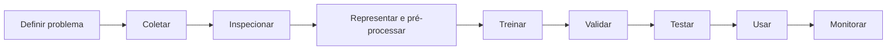

# Conceitos

[← Índice do módulo](README.md) · [Prática →](pratica.md)

Qualidade inclui validade, completude e consistência; representatividade pergunta quem e quais
condições estão ausentes. Ausentes e outliers podem ser erro, evento raro ou informação do
processo — não há tratamento universal.

Treino ajusta parâmetros; validação orienta escolhas; teste estima desempenho apenas ao final.
Reutilizar o teste durante o desenvolvimento adapta decisões a ele. Ajustar escala, imputação ou
seleção de atributos antes da divisão deixa informação do conjunto preservado entrar no treino:
isso é **vazamento de dados (data leakage)**.

> **Equívoco comum:** mais dados não garantem um modelo melhor. Dados adicionais podem repetir
> viés, ter rótulos ruins ou vir de outra população.

Dados pessoais exigem finalidade, minimização, proteção, base apropriada e consideração de
consentimento. Um atributo aparentemente neutro pode funcionar como proxy de característica
sensível. Métricas agregadas podem esconder danos concentrados.
