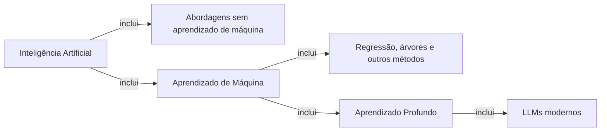

# Visão geral

[← Voltar à aula principal](../README.md) · [Jornada de aprendizado →](jornada-de-aprendizado.md)

O curso trata aprendizado de máquina como encontro entre modelagem matemática, computação,
evidência empírica e engenharia de software. Uma previsão é a saída de uma função parametrizada,
não uma verdade. Dados carregam decisões de coleta; métricas carregam escolhas de prioridade.

As setas significam “inclui”, não equivalência. Assim, `DL ⊂ ML ⊂ IA`. Existem sistemas de IA
que não usam ML e métodos de ML que não usam redes profundas. Um LLM moderno não é um campo no
mesmo nível: é uma família de modelos de linguagem implementada com redes neurais profundas,
normalmente Transformers.
