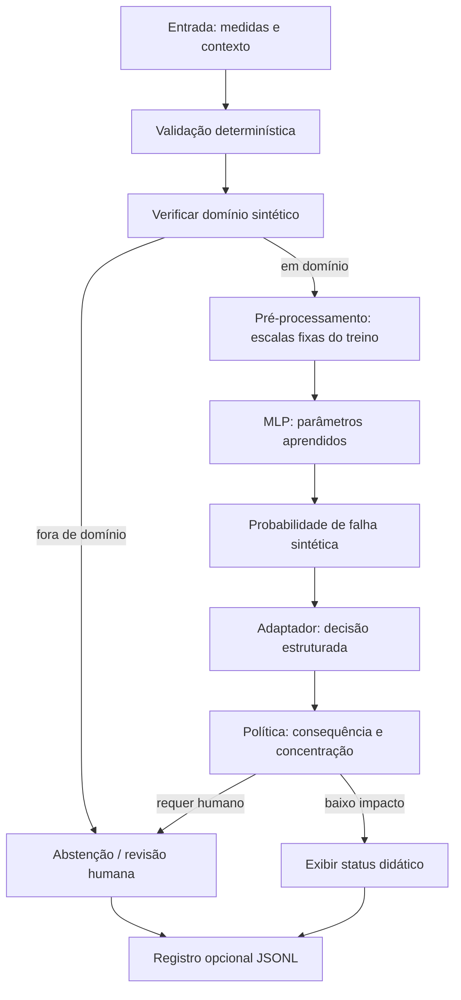

# Projeto integrador: monitoramento sintético com revisão humana

[← Engenharia](../engenharia-de-ml/README.md) · [Trilha](../docs/jornada-de-aprendizado.md)

Objetivo: integrar fundamentos e software em uma aplicação local pequena.
Você já conhece temperatura/vibração, logística, escalas e falha nas próximas
24 horas. Agora percorra dados → MLP → artefato → inferência → decisão → política.
O projeto é inspirado no padrão de decisões estruturadas estudado com Jev,
**não usa Jev oficial obrigatoriamente e não controla equipamentos reais**.

## Arquitetura e responsabilidades



A MLP aprende pesos; médias/desvios também são estimados, só no treino. Aplicar
escalas, validar entrada, limiares, política e logs são código determinístico.
Probabilidade é uma saída aprendida, não permissão. A consequência vem do contexto
da aplicação; não deve ser adivinhada pela rede. Side effects aqui são somente
escrever arquivos solicitados e imprimir saídas. Nenhuma revisão liga/desliga máquina.

## Execute do começo ao fim

Na raiz, depois da instalação base:

```bash
python -m sos_ml.assess
python -m sos_ml.network_demo
python -m sos_ml.local_ai treinar --plot artifacts/mlp_treino_validacao.png
python -m sos_ml.local_ai inferir --temperature 80 --vibration 5 --measure --log artifacts/decisoes.jsonl
python -m sos_ml.local_ai inferir --temperature 80 --vibration 5 --high-consequence
python -m sos_ml.local_ai inferir --temperature 150 --vibration 5
```

Depois de instalar o extra torch conforme a etapa PyTorch, compare a automação das
mesmas contas e a recarga de state_dict em outro processo:

```bash
python -m sos_ml.torch_demo treinar
python -m sos_ml.torch_demo inferir
make validate-torch
```

400 exemplos são repartidos em 240/80/80. Há uma escala por coluna, ajustada só
no treino. Taxa 0,1 e 1000 épocas máximas, com paciência 100, são fixadas antes de
olhar o teste. Restaura-se a menor BCE de validação (melhora mínima 1e−8), inclusive
o estado inicial se nenhuma atualização melhorar. O teste é avaliado ao final
com limiar fixo 0,5. O baseline usa maioria no treino.

Execução registrada: melhor época 92, acurácia 0,775 e F1 0,7; baseline 0,5875.
Para [80,5], p≈0,651786 e concentração≈0,303572. O adaptador sugere inspeção;
com consequência alta, política substitui por revisão. Para [150,5], sem inferência,
p=null e abstenção. Os números verificam implementação, não segurança industrial.
O melhor estado não é a última época: interprete a linha vertical do gráfico.

Não se pode concluir que a rede “ganhou/perdeu” por ser maior: a logística anterior
usou 320 exemplos de treino, enquanto a MLP reserva validação. O mesmo teste de 80
já teve resultados publicados no curso: reutilização didática, não nova evidência
independente. Um estudo comparativo exigiria protocolo e teste final próprios,
mesma partição e avaliação de múltiplas sementes sem seleção pelo teste.

## O que entregar

1. Diagrama com responsabilidades de cada componente e unidades/ordem das entradas.
2. Contas manuais de um neurônio, camada, métrica e derivada local.
3. Execução NumPy e comparação PyTorch; tolerâncias justificadas para forward/gradientes.
4. Registro das partições, sementes, curva de validação e melhor época restaurada.
5. Artefato inspecionado e inferência em novo processo sem fit nem reajuste de escala.
6. Pelo menos três cenários de política, incluindo recusa explícita de automação.
7. Log sintético e análise de latência/bytes com escopo da medição.
8. Nota de limites: rótulo aleatório, calibração, proxies, shift, privacidade e usos proibidos.

Não envie .venv ou segredos. Os artefatos gerados ficam ignorados pelo Git e são
regeneráveis. A integração Jev live é opcional e não rende pontos extras por pagar
acesso. Sem credencial, o fixture offline demonstra o contrato e a revisão.

## Rubrica (100 pontos)

| Critério | Pontos | Evidência |
|---|---:|---|
| Fundamentos e matemática | 20 | cálculo explicado e símbolos ligados ao código |
| Dados, partições e avaliação | 20 | sem vazamento, baseline, erros e validação separada |
| Implementação e ponte PyTorch | 20 | módulos reutilizáveis, formas/gradientes e equivalência |
| Persistência e inferência | 15 | contrato validado e execução em processo novo |
| Política e revisão humana | 15 | recusa por ambiguidade/consequência/domínio e motivo |
| Reprodutibilidade, medição e limites | 10 | testes, ambiente, escopo e nota crítica |

Um fluxo que seleciona pelo teste ou apresenta controle industrial com dados
sintéticos precisa ser corrigido antes de ser considerado concluído, mesmo se
alcançar boa métrica. O instrutor deve providenciar ambiente CPU compatível para
a etapa PyTorch; não é aceitável exigir GPU ou serviço pago como solução de ambiente.

## Verificação

```bash
make validate
make validate-torch
```

A base verifica todos os exercícios anteriores e os novos caminhos locais.
O alvo PyTorch exige biblioteca instalada e verifica equivalência, state_dict e
inferência; testes não consultam rede. Confirme também links/exemplos da documentação.

O modelo é apenas um componente do sistema. Dados, avaliação, engenharia,
política, incerteza, segurança, observabilidade e julgamento humano continuam essenciais.

[Exercícios](exercicios.md) · [Referências](referencias.md)
